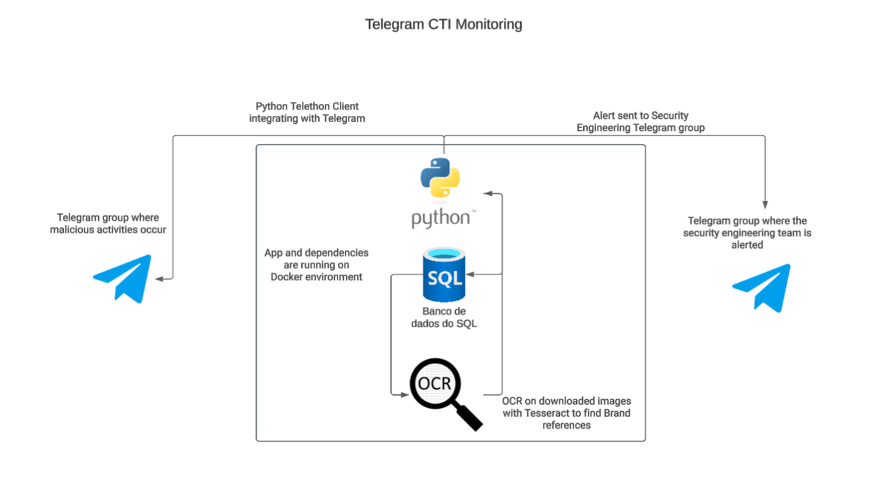
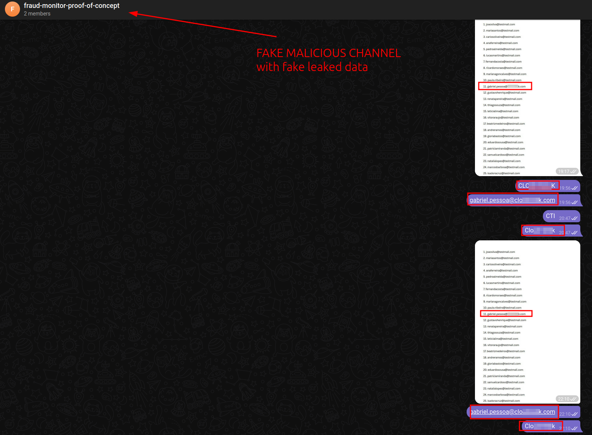
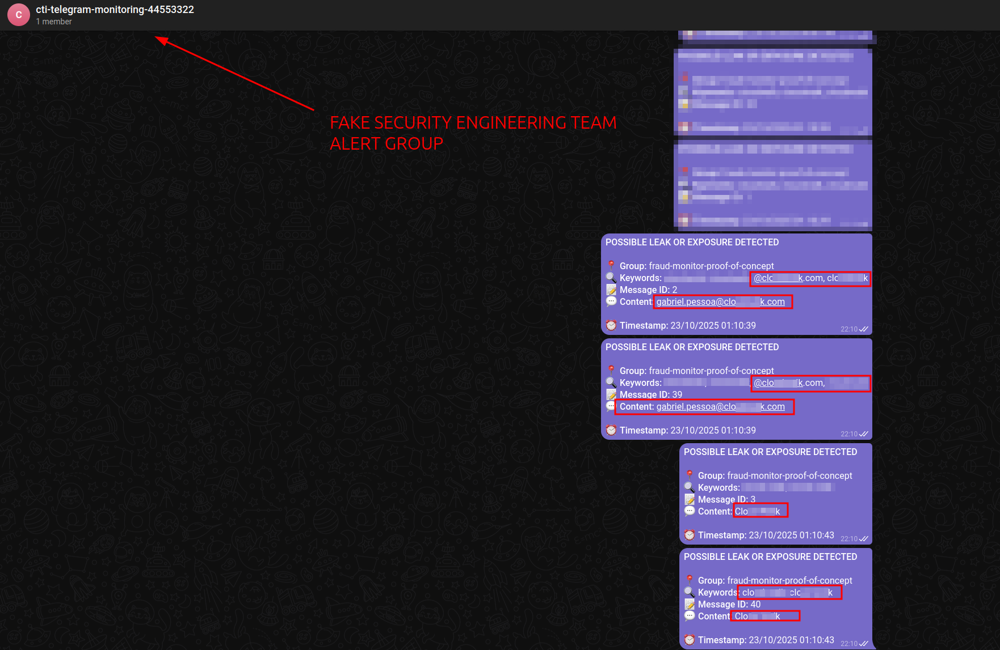

# Telegram CTI Monitoring

A Python-based monitoring system for Telegram channels using OCR (Optical Character Recognition) to extract and analyze text content from images.

### What it is

A Python worker that monitors specific Telegram groups in real-time, collects text messages and images, extracts text from images using OCR, compares everything against a keyword list, logs history to database, and sends alerts when sensitive terms are found.

### How it works

Connects to Telegram via Telethon, for each new message reads the text, if there's an image downloads the bytes and runs Tesseract to extract text, concatenates the contents, checks for presence of keywords defined in the configuration file, persists the message and, if there's a match, creates an alert and sends a notification to the alert group.

### Components

- **Telethon** for Telegram integration
- **pytesseract and Pillow** for OCR
- **SQLAlchemy** with Message and Alert models and SQLite database for persistence
- **Pydantic Settings and .env** for configuration
- **Docker** for packaging and execution with Tesseract installed
- **Mounted volumes** to maintain session and database between restarts

## Application Flow



## Monitoring Examples

### Monitored Malicious Channel
The system monitors specific Telegram channels for sensitive content:



### Security Engineering Team Alerts
When keywords are detected, alerts are sent to the security engineering team:



## Features

- Automated Telegram channel monitoring
- OCR text extraction from images
- Database storage for monitoring data
- Docker containerization support

## Prerequisites

- Docker and Docker Compose
- Telegram API credentials

## Setup

### 1. Environment Configuration

This is a Proof of concept projetc, so you will run it locally, so create a `.env` file in the project root with the following variables:

```env
# Telegram API Configuration (get from https://my.telegram.org/apps)
API_ID=your_telegram_api_id
API_HASH=your_telegram_api_hash
PHONE_NUMBER=+1234567890

# Monitoring Configuration
TELEGRAM_GROUPS=@channel1,@channel2,@channel3
ALERT_GROUP_ID=-10000000000000 (example negative number)
BRAND_KEYWORDS=keyword1,keyword2,keyword3
```

### Environment Variables Explanation:

- **`API_ID`**: Your Telegram API ID (get from https://my.telegram.org/apps)
- **`API_HASH`**: Your Telegram API Hash (get from https://my.telegram.org/apps)
- **`PHONE_NUMBER`**: Your phone number with country code (e.g., +1234567890)
- **`TELEGRAM_GROUPS`**: Comma-separated list of channels/groups to monitor (e.g., @channel1,@channel2)
- **`ALERT_GROUP_ID`**: Telegram group ID where alerts will be sent (get from @userinfobot)
- **`BRAND_KEYWORDS`**: Comma-separated keywords to monitor for (e.g., brand1,brand2,competitor)

### 2. Directory Structure

- **`/data`**: Contains the SQLite database file (`monitor.db`) for storing monitoring data and extracted text
- **`/session`**: Stores Telegram session files (`telethon.session`) for authentication persistence

### 3. Installation

```bash
# Run with Docker Compose
sudo docker-compose run --rm worker
```

## Usage

1. Configure your `.env` file with valid Telegram API credentials
2. Run the application with Docker Compose
3. The system will automatically monitor the specified Telegram channels
4. Extracted text from images will be stored in the database

## Project Structure

```
├── data/               # Database storage directory
│   └── monitor.db      # SQLite database file
├── session/            # Telegram session storage
│   └── telethon.session # Authentication session file
├── worker.py           # Main application file
├── models.py           # Database models
├── database.py         # Database configuration
├── crud.py             # Database operations
├── requirements.txt    # Python dependencies
├── Dockerfile          # Docker configuration
└── docker-compose.yml  # Docker Compose configuration
```

## Notes

- The `/data` directory will be created automatically if it doesn't exist
- The `/session` directory stores your Telegram authentication session
- Make sure to keep your `.env` file secure and never commit it to version control

